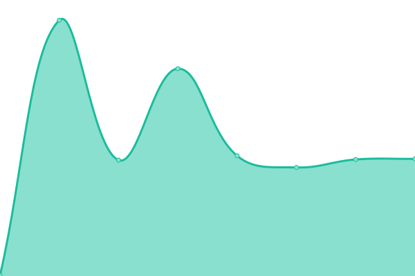
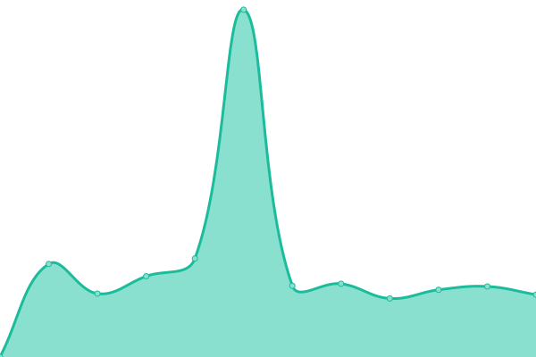

# [📈 Live Status](https://status.m5e.de): <!--live status--> **🟩 All systems operational**

This repository contains the open-source uptime monitor and status page for [Christoph Daniel Miksche](http://christoph.miksche.org), powered by [Upptime](https://github.com/upptime/upptime).

With [Upptime](https://upptime.js.org), you can get your own unlimited and free uptime monitor and status page, powered entirely by a GitHub repository. We use [Issues](https://github.com/CMiksche/status/issues) as incident reports, [Actions](https://github.com/CMiksche/status/actions) as uptime monitors, and [Pages](https://status.m5e.de) for the status page.

<!--start: status pages-->
<!-- This summary is generated by Upptime (https://github.com/upptime/upptime) -->
<!-- Do not edit this manually, your changes will be overwritten -->
<!-- prettier-ignore -->
| URL | Status | History | Response Time | Uptime |
| --- | ------ | ------- | ------------- | ------ |
|  [English Blog](https://blog.m5e.de) | 🟩 Up | [english-blog.yml](https://github.com/CMiksche/status/commits/HEAD/history/english-blog.yml) | 

 248ms
     
 | 

<a href="https://status.m5e.de/history/english-blog">100.00%</a>
    

|  [German Blog](https://christoph.miksche.org) | 🟩 Up | [german-blog.yml](https://github.com/CMiksche/status/commits/HEAD/history/german-blog.yml) | 

 527ms
     
 | 

<a href="https://status.m5e.de/history/german-blog">100.00%</a>
    

|  [German Tech Blog](https://blog.wronnay.net) | 🟩 Up | [german-tech-blog.yml](https://github.com/CMiksche/status/commits/HEAD/history/german-tech-blog.yml) | 

 476ms
     
 | 

<a href="https://status.m5e.de/history/german-tech-blog">100.00%</a>
    

|  Kanboard | 🟩 Up | [kanboard.yml](https://github.com/CMiksche/status/commits/HEAD/history/kanboard.yml) | 

 1236ms
     
 | 

<a href="https://status.m5e.de/history/kanboard">99.64%</a>
    

|  Grocy | 🟩 Up | [grocy.yml](https://github.com/CMiksche/status/commits/HEAD/history/grocy.yml) | 

 1921ms
     
 | 

<a href="https://status.m5e.de/history/grocy">99.66%</a>
    

<!--end: status pages-->

[**Visit our status website →**](https://status.m5e.de)

## 📄 License

- Powered by: [Upptime](https://github.com/upptime/upptime)
- Code: [MIT](./LICENSE) © [Christoph Daniel Miksche](http://christoph.miksche.org)
- Data in the `./history` directory: [Open Database License](https://opendatacommons.org/licenses/odbl/1-0/)
